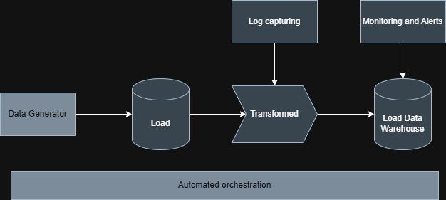

# Project Title

# Industrial Data Pipeline Simulation

## Problem  

Simulate real-world telemetry ingestion and build automated ETL pipeline with monitoring.

## Architecture

Generator → Raw Layer → Cleaning → Warehouse → Monitoring

## Tech Stack

- Python
- SQL
- PostgreSQL
- Pandas
- Automated orchestration
- Features
- Automated ingestion
- Data quality validation
- Warehouse loading
- Monitoring alerts

# How to Run
python pipeline_runner.py